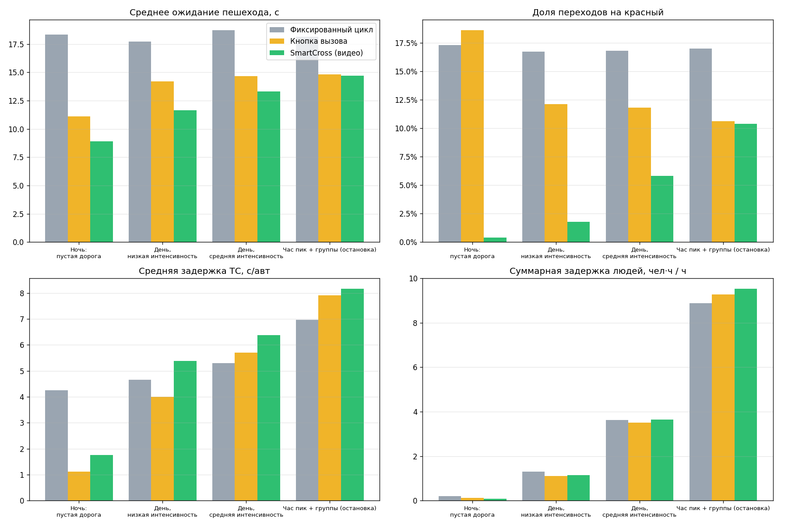
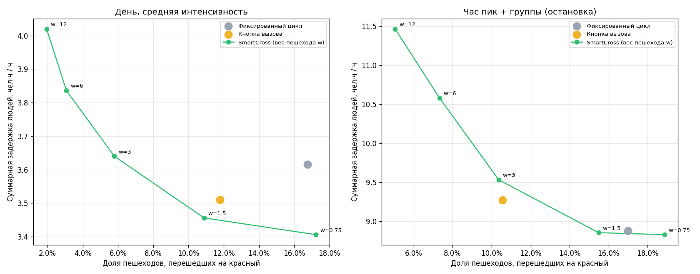

# Алгоритмы

Код: `smartcross/traffic/flow.py`, `smartcross/controller/timing.py`, `smartcross/controller/fsm.py`,
`smartcross/engine.py`.

## 1. Распознавание и зоны

- Детектор **YOLO11n** (Ultralytics) + трекер **ByteTrack**. Классы COCO: person, bicycle, car,
  motorcycle, bus, truck. Инференс на CPU ~50 мс/кадр (640 px), 5–6 к/с на камеру.
- Объект привязывается к зоне по **точке касания земли** (середина нижней стороны рамки).
  Для перспективного вида это точнее, чем центр рамки.
- Зоны задаются в нормированных координатах (0…1), поэтому переживают смену разрешения камеры:
  - `ped_wait` — зона ожидания стороны A/B: сколько людей ждёт;
  - `crosswalk` — переход: кто на переходе и уникальные пешеходы для статистики.
    Трек засчитывается, только если держится ≥ 3 кадров: это фильтр переключений ID;
  - `approach` — зона подхода ТС с длиной в метрах: машины в зоне и плотность;
  - `count_line` — линия подсчёта: машина засчитывается, когда отрезок между её прошлым и
    текущим положением пересекает линию. Положение трека помнится 30 кадров, поэтому
    пропуск детекции на пару кадров не теряет машину. Без линии машина засчитывается при
    выходе из зоны подхода.
- **Спецтранспорт.** В COCO нет класса «скорая/полиция». Базовый способ — детектор
  проблескового маячка. В верхней трети рамки ТС ищем яркие насыщенные красные/синие пиксели.
  Если их доля резко меняется от кадра к кадру (коэффициент вариации ≥ 0,6 на 12 кадрах,
  подтверждение 4 раза подряд), машина помечается как спецтранспорт. Для эксплуатации
  подключается модель, дообученная на спецтехнике: её классы перечисляются в
  `detector.emergency_classes`, код менять не нужно.

## 2. Интенсивность и плотность потока

Интенсивность q (авт/ч) считается по событиям проезда линии подсчёта за **адаптивное окно**:

```
T = clamp(N_target / q_prev, T_min, T_max),   N_target = 30,  T_min = 60 с,  T_max = 900 с
q = N(T) · 3600 / T,   затем сглаживание EWMA (α = 0,3, раз в секунду)
```

**Как выбран интервал.** Число машин в окне примерно распределено по Пуассону, его
относительная ошибка ≈ 1/√N. Требование «ошибка ≤ ~18%» даёт N ≈ 30 машин. Отсюда:
- в плотном потоке (2400 авт/ч) окно ≈ 45 с → ограничено 60 с: оценка быстро реагирует на
  начало и конец пика;
- днём (600 авт/ч) окно ≈ 3 мин;
- ночью (60 авт/ч) окно растёт до 15 мин, и одна случайная машина не дёргает оценку.

Фиксированное окно так не умеет. Короткое окно ночью шумит, длинное днём запаздывает на
десятки минут. Тесты: `tests/test_flow.py`: точность ±30% на 300/1200/3000 авт/ч, подстройка
окна, реакция на скачок потока.

Плотность k (авт/км) = машин в зонах подхода / суммарная длина зон. Показывается оператору и
пишется в статистику.

## 3. Автомат фаз и безопасность

```
VEH_GREEN → VEH_GREEN_BLINK (3 с) → VEH_YELLOW (3 с) → ALL_RED (2 с)
  → PED_GREEN → PED_GREEN_BLINK (3 с) → ALL_RED (2 с + продление) → VEH_GREEN
FLASHING (жёлтый мигающий): вход только из VEH_GREEN, выход через ALL_RED
```

- Длительность зелёного пешеходам: `max(ped_min_green, t_старта + L/v − t_мигания)`.
  L — длина перехода, v = 1,3 м/с (ОДМ 218.6.003). При L = 14 м получается ≈ 12 с.
  Большой группе добавляется 0,4 с на человека сверх порога, но не больше 8 с.
- **Продление «всё красное».** Если по видео на переходе ещё есть люди (опоздавшие, медленные),
  зелёный машинам не включается, пока они не уйдут. Продление ограничено 8 с.
- **Конфликт-монитор** (`safety.py`) — отдельный от логики модуль, аналог MMU дорожного
  контроллера. Он проверяет каждый такт:
  - нет одновременного разрешающего сигнала машинам и пешеходам;
  - переходы между фазами допустимые;
  - соблюдены минимальные длительности фаз.

  При нарушении система защёлкивается в жёлтом мигающем до сброса оператором. На первом
  запуске на реальном видео монитор именно так и сработал: сам монитор начал наблюдение позже
  контроллера и счёл первую фазу слишком короткой. Ошибку в мониторе исправили (длительность
  первой наблюдаемой фазы не проверяется), а поведение «при сомнении — жёлтый мигающий»
  подтвердилось на практике.
- Тесты: `tests/test_controller.py`. Среди них property-based (hypothesis): сотни случайных
  последовательностей наблюдений, смен режимов и отказов. Ни одного конфликта и ни одного
  превышения предельного ожидания.

## 4. Когда включать пешеходную фазу

Вызов регистрируется, если человек простоял в зоне ожидания ≥ 1 с. Это фильтр
проходящих мимо. Дальше в фазе VEH_GREEN проверяется по порядку:

1. **Спецтранспорт** приближается → зелёный машинам удерживается (не дольше 30 с).
2. **Дорога пуста**: в зонах подхода никого нет ≥ 3 с, и за время пешеходной фазы ожидается
   меньше одной машины (q·P < 3600). Тогда пешеходы идут через **2 с** после вызова (не раньше
   4 с зелёного ТС). Это прямой ответ на пункт «минимальная задержка при отсутствии ТС».
3. **Минимальный зелёный ТС** (12 с) не истёк → ждём.
4. **Предел ожидания** пешехода (50 с) → включаем безусловно.
5. **Пропускная способность.** Зелёный ТС не короче
   `g_cap = y·P / (x_max − y)`, где y = q_полосы / s (s = 1800 авт/ч на полосу),
   P ≈ 25 с — пешеходная фаза с промтактами, x_max = 0,9. При таком зелёном степень насыщения
   x = y·(g+P)/g не превышает 0,9, и очереди машин рассасываются каждый цикл.
6. **Критерий накопленной задержки.** Одна пешеходная фаза обходится водителям и пассажирам в

   ```
   K = n_пасс · q · P² / (2·(1 − y))      [чел·с]
   ```

   Это задержка машин, подъехавших за красный интервал P (равномерная составляющая формулы
   Вебстера). Пока пешеходы ждут, копится их «стоимость ожидания»:

   ```
   A = Σ по ждущим ∫ w · (1 + t/τ) dt
   ```

   Здесь w = 3 — вес времени пешехода, τ = 20 с — рост нетерпения: каждая следующая секунда
   ожидания дороже предыдущей, потому что после ~30 с растёт доля переходов на красный (HCM).
   Фаза включается, когда **A ≥ K**. Это правило оптимальной «очистки» очереди с платой за
   обслуживание (для линейной стоимости оно даёт классический цикл EOQ T* = √(2K/λ)).
   - **Приоритет групп получается сам собой:** 8 человек копят A в 8 раз быстрее одного.
     Сверх этого для группы ≥ `group_threshold` (6) порог K умножается на 0,5.
   - **Учёт плотности:** K растёт с интенсивностью q, взятой за адаптивный интервал (п. 2).
     Чем плотнее поток, тем дороже прерывать его и тем дольше ждёт одиночный пешеход.
     Группа при этом по-прежнему проходит быстро.
7. **Разрыв в потоке** ≥ 3 с → порог снижается вдвое (A ≥ 0,5·K). В разрыве никому не надо
   тормозить прямо сейчас.

Ожидаемое время ожидания (аналитически; на «Мониторинге» показывается живая оценка):

| Интенсивность, авт/ч | 1 пешеход | 3 пешехода | группа 8 |
|---|---|---|---|
| 60, в зоне подхода никого (ночь) | 2 с | 2 с | 2 с |
| 60, машина в зоне подхода | 12 с (мин. зелёный) | 12 с | 12 с |
| 500 | 14,5 с | 12 с | 12 с |
| 1000 | 26 с | 12 с | 12 с |
| 2000 | 47 с | 22 с | 12 с |
| 3000 | 50 с (предел) | 34 с | 21 с (пропускная способность) |

Время отсчитывается от момента, когда пешеход встал в зону ожидания, при условии, что зелёный
ТС к этому моменту уже идёт дольше минимального. При разрыве в потоке ожидание короче.

(Точные значения даёт `timing.expected_ped_delay_s` для текущих настроек.)

### Почему не формула Вебстера напрямую

Цикл Вебстера C₀ = (1,5L + 5)/(1 − Y) минимизирует задержку **только машин**. Первая версия
алгоритма задерживала пешеходов на весь зелёный Вебстера. В час пик это ~41 с ожидания и
больше нарушений, чем у обычной кнопки (см. историю в `reports/`). Цикл Вебстера остаётся:
- для фиксированного режима с историческими интенсивностями;
- как справочная величина на мониторинге.

## 5. Аварийные и особые режимы

| Режим | Когда | Как работает |
|---|---|---|
| **Адаптивный** | все камеры исправны, все зоны покрыты | алгоритм из п. 4 |
| **Деградированный** | отказала часть камер, или какая-то зона ни одной камерой не покрыта | тот же алгоритм по уцелевшим камерам + пешеходная фаза не реже раза в 60 с. Нет камеры подхода — интенсивность берётся из **исторического профиля по часу суток** (БД), правило «дорога пуста» и досрочное переключение отключаются |
| **Фиксированный цикл** | исправных камер нет | жёсткий цикл, зелёный ТС рассчитан по Вебстеру на историческую интенсивность этого часа (иначе 40 с) |
| **Жёлтый мигающий** | по настройке при полном отказе, по ночному расписанию, по срабатыванию конфликт-монитора или по команде оператора | пешеходные секции выключены |
| **Кнопка** (опционально) | если на объекте осталось вызывное устройство (GPIO) | нажатие = вызов пешеходной фазы в адаптивном и деградированном режимах |

Отказ камеры определяется так:
- нет кадров > 3 с (**обрыв**);
- кадр не меняется > 6 с (**зависание** кодека или потока);
- средняя яркость < 8 (**закрыта**: краска, снег, пакет).

Возврат в адаптивный режим — только после **10 с стабильной работы** (гистерезис против
«дребезга»). При старте система работает по фиксированному циклу, пока камеры не выдадут
первые кадры.

Все переходы режимов пишутся в журнал событий. Отказ можно имитировать кнопками на
«Мониторинге» или через API `POST /api/cameras/{id}/fault`.

## 6. Выход на светофор

`hw/output.py`: логические сигналы → лампы, мигание 1 Гц делает драйвер. Драйверы:
- `mock` — демо;
- `gpio` — реле через libgpiod v2 на встраиваемом ПК/SBC. Линии и вход кнопки задаются
  в конфиге.

В реальном шкафу система подключается к дорожному контроллеру (вход «вызов пешеходной фазы» /
протокол контроллера). Конфликт-монитор контроллера при этом остаётся последней линией защиты.

## 7. Результаты моделирования

`python -m smartcross.sim --hours 2 --seeds 5` — 4 сценария, 5 прогонов по 2 ч, одинаковые
случайные потоки для всех стратегий. Модель:
- машины: пуассоновский поток, точечная очередь, разъезд с насыщением 1800 авт/ч/полосу и
  потерей 2 с на старте;
- пешеходы: пуассоновский поток + группы (остановка транспорта), у каждого терпение
  (лог-нормальное, медиана 45 с), по его истечении человек переходит на красный;
- у кнопки 25% пешеходов её не нажимают (сломана, не заметили);
- у видео 10% пропусков детекции людей и 5% машин.

| Сценарий | Стратегия | Ожидание пешехода, с (ср / 95%) | На красный | Задержка ТС, с/авт | Сумм. задержка людей, чел·ч/ч |
|---|---|---|---|---|---|
| Ночь | Фиксированный цикл | 18,3 / 42,2 | 17,3% | 4,3 | 0,21 |
| Ночь | Кнопка | 11,1 / 26,2 | 18,6% | 1,1 | 0,13 |
| Ночь | **SmartCross** | **8,9 / 11,3** | **0,4%** | 1,8 | **0,09** |
| День, низкая | Фиксированный цикл | 17,7 / 46,2 | 16,7% | 4,7 | 1,30 |
| День, низкая | Кнопка | 14,2 / 38,6 | 12,1% | 4,0 | 1,11 |
| День, низкая | **SmartCross** | **11,6 / 23,8** | **1,8%** | 5,4 | 1,15 |
| День, средняя | Фиксированный цикл | 18,7 / 45,9 | 16,8% | 5,3 | 3,62 |
| День, средняя | Кнопка | 14,7 / 39,0 | 11,8% | 5,7 | 3,51 |
| День, средняя | **SmartCross** | **13,3 / 33,1** | **5,8%** | 6,4 | 3,64 |
| Час пик + группы | Фиксированный цикл | 18,1 / 47,1 | 17,0% | 7,0 | 8,88 |
| Час пик + группы | Кнопка | 14,8 / 39,0 | 10,6% | 7,9 | 9,27 |
| Час пик + группы | **SmartCross** | 14,7 / 39,4 | 10,4% | 8,2 | 9,53 |

Выводы:
- **Ночь и низкая интенсивность** — главный сценарий кейса. Пешеход ждёт в 2 раза меньше,
  нарушений почти нет: в 10–40 раз меньше, чем у фиксированного цикла. Пустые пешеходные
  фазы (40 из 55 в час у фиксированного цикла) исчезают.
- **Средняя интенсивность:** нарушений в 2–3 раза меньше при той же суммарной задержке людей.
- **Час пик:** по суммарной задержке немного хуже, это цена **продления «всё красное»**, пока
  на переходе люди. Базовые стратегии такой защиты не имеют. С выключенным продлением
  SmartCross в пике даёт 8,70 чел·ч/ч и 9,8% нарушений: лучше обеих базовых стратегий по
  обоим показателям.
- **Компромисс настраивается.** Вес времени пешехода `control.ped_time_weight` двигает систему
  по кривой Парето «задержка ↔ нарушения» (рисунок ниже). В средней интенсивности вся кривая
  SmartCross лежит левее-ниже точек фиксированного цикла и кнопки.





Подбор параметров: `python scripts/tune.py`.
