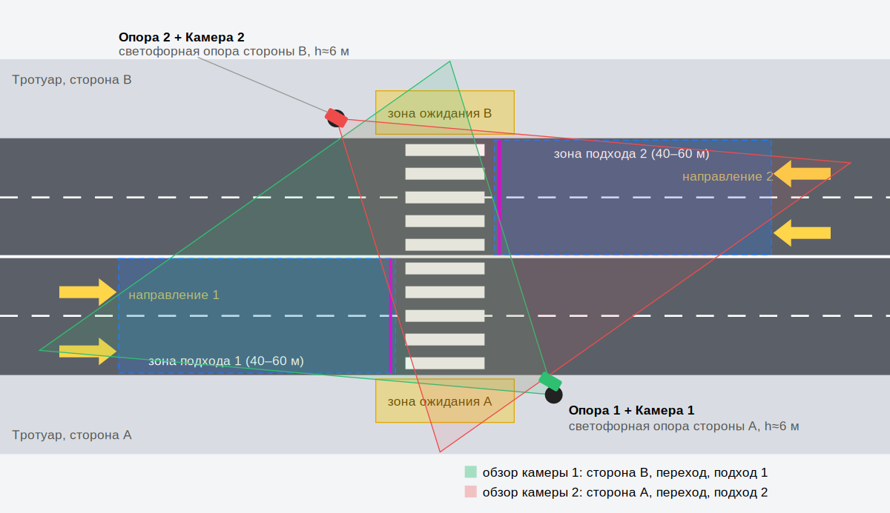

# Расстановка видеокамер

## Что должна видеть система

| Зона | Зачем | Минимальная дальность |
|---|---|---|
| Зоны ожидания A и B (тротуар у бордюра) | вызов пешеходной фазы, размер группы | до противоположного бордюра, ~15–20 м |
| Пешеходный переход | счёт пешеходов, продление «всё красное», пока на переходе люди | 10–25 м |
| Зоны подхода ТС для каждого направления | интенсивность, плотность, разрывы в потоке, спецтранспорт | 40–60 м выше по потоку от стоп-линии |

Длина зоны подхода берётся так, чтобы автомобиль на 60 км/ч (16,7 м/с) был обнаружен
не позже чем за 3 с до перехода: 16,7 × 3 = 50 м.

## Схема «крест-накрест»: 2 камеры на штатных светофорных опорах

- **Камера 1** — на светофорной опоре стороны A, на кронштейне на высоте ≈ 6 м (типовая
  консоль/кронштейн светофорной опоры). Направлена через дорогу, на противоположный тротуар.
  В кадре: зона ожидания **B**, переход и зона подхода **направления 1**.
- **Камера 2** — симметрично на опоре стороны B. В кадре: зона ожидания **A**, переход и
  зона подхода **направления 2**.

Почему так, а не «каждая камера смотрит себе под ноги»:

1. **Мёртвая зона.** Камера на высоте 6 м с наклоном 18° не видит первые ~7 м под собой
   (расчёт ниже), то есть свой бордюр. Противоположный бордюр на расстоянии 15–20 м она видит
   хорошо: человек занимает 40–100 px.
2. **Перспектива.** Если смотреть поперёк дороги под углом, пешеходы в группе меньше
   перекрывают друг друга, чем при взгляде вдоль тротуара.
3. **Резервирование.** Пешеходный переход и часть обеих сторон видны обеим камерам.
   При отказе одной камеры система остаётся в *деградированном* режиме: работает по уцелевшей
   камере и принудительно вызывает пешеходную фазу не реже, чем раз в `degraded_recall_s`.
   В жёсткий фиксированный цикл она не падает.
4. **Никаких новых опор.** Используются штатные светофорные опоры. Если на них нет места,
   подойдут опоры освещения (8–10 м): высота только улучшает обзор, но угол наклона нужно
   увеличить.

Для широких улиц (6+ полос) или переходов с островком безопасности добавляется третья камера
на островке. Конфигурация это поддерживает: число камер не ограничено, покрытие зон
проверяется автоматически.

## Расчёт обзора и разрешения

Скрипт: `python scripts/camera_geometry.py --height 6 --hfov 70 --tilt 18 --imgsz 960`

Камера 1920×1080, объектив ≈ 4 мм (HFOV 70°), высота 6 м, наклон 18°:

| Дальность, м | Ширина обзора, м | Рост человека, px (кадр) | px на входе YOLO (960) | Легковой (4,5 м), px |
|---|---|---|---|---|
| 10 | 16 | 200 | 100 | 529 |
| 20 | 29 | 112 | 56 | 295 |
| 30 | 43 | 76 | 38 | 202 |
| 40 | 57 | 58 | 29 | 153 |
| 50 | 71 | 46 | 23 | 123 |
| 60 | 84 | 39 | 19 | 102 |

Мёртвая зона под камерой: 7,3 м.

YOLO уверенно находит объекты от ~20–25 px по высоте на входе сети. Отсюда:
- пешеходы в зонах ожидания и на переходе (до ~35 м) находятся с запасом;
- автомобили находятся на всей зоне подхода (60 м и дальше).

Широкоугольный объектив 2,8 мм (HFOV 90°) при входе 640 даёт человеку на 20 м всего 26 px.
Это на грани, поэтому рекомендуем 4 мм и вход сети 960. На встраиваемом ПК без GPU это
~100–150 мс на кадр, при 5–6 к/с на камеру укладываемся.

## Требования к камере

- IP-камера с RTSP (H.264/H.265), 1080p, 10–15 к/с. Обработка идёт на 5–6 к/с.
- Широкий динамический диапазон (WDR ≥ 120 дБ): встречный свет фар, низкое солнце.
- ИК-подсветка 30–50 м для ночи. YOLO работает и по ч/б изображению.
- IP66/IP67, рабочая температура −40…+60 °C, подогрев (зима), козырёк от осадков.
- Питание PoE от шкафа светофорного объекта, туда же приходит сеть до встраиваемого ПК.

## Как проверить установку

1. В веб-интерфейсе («Настройка → Камеры и зоны») появился кадр с камеры.
2. На кадре мышкой размечены зоны: ожидание, переход, подход с длиной в метрах, линия подсчёта.
3. На «Мониторинге» при проходе людей растёт счётчик «Ждут переход», а при проезде машин
   растёт интенсивность.
4. Кнопки имитации отказа («Обрыв», «Зависание», «Закрыта») переводят систему в
   деградированный режим, «Восстановить» через `recovery_s` возвращает адаптивный.
